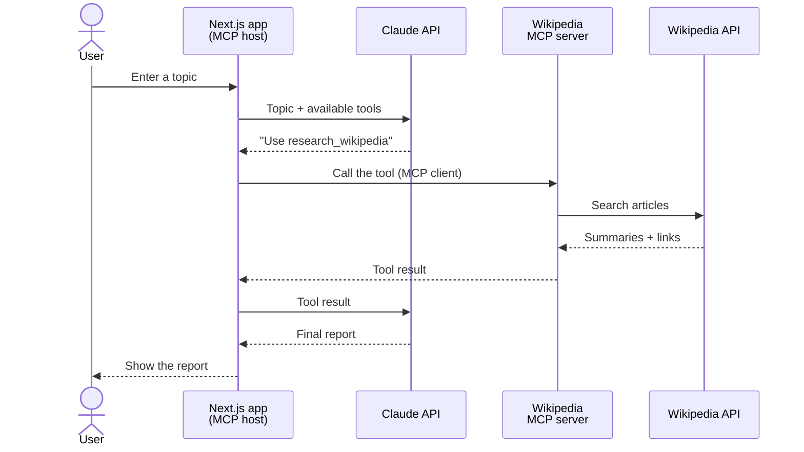

# Wiki Research MCP

A small research assistant built to understand how MCP clients, MCP servers, tools and language models work together.

The application lets a user enter a topic, researches it through a custom Wikipedia MCP server, and uses Claude to generate a clear report with sources.

## What We’re Building



The application follows this flow:

1. The user submits a research topic.
2. Claude decides to use the research tool.
3. The Next.js backend sends the tool request through an MCP client.
4. The MCP server searches Wikipedia.
5. The tool result is returned to Claude.
6. Claude creates the final research report.

## Tech Stack

- Next.js
- TypeScript
- Claude API
- Model Context Protocol
- Wikipedia API
- Zod
- Tailwind CSS

## Project Structure

```text
wiki-research-mcp/
├── apps/
│   └── web/
├── packages/
│   └── wiki-mcp-server/
└── README.md
```
